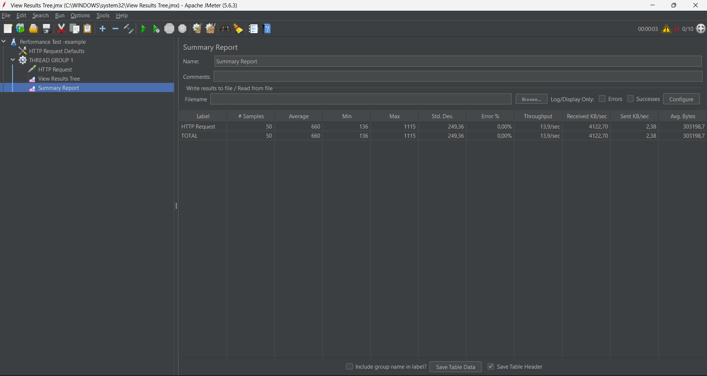
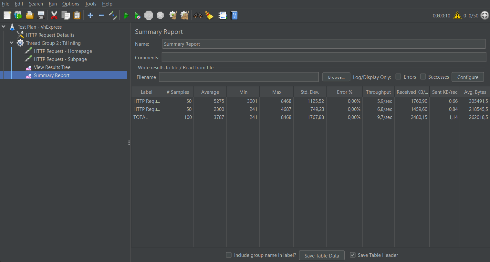
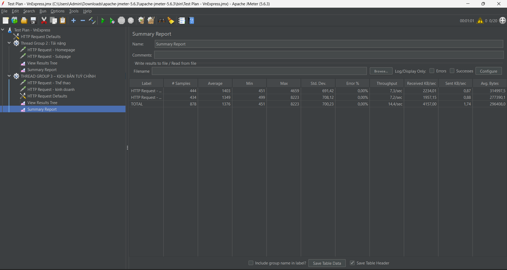

## Thread Group 1 – Kịch bản cơ bản 
- Users: 10
- Loop Count: 5
- Total Requests: 50

### Kết quả:
- Average Response Time: 798 ms
- Throughput: 9.1 requests/sec
- Error Rate: 0%

  

### Nhận xét:
- Hệ thống phản hồi nhanh và ổn định ở mức tải cơ bản.
- Không xuất hiện lỗi trong quá trình kiểm thử.

## Thread Group 2 – Kịch bản tải nặng
- Users: 50
- Loop Count: 1
- Số HTTP Requests trong mỗi vòng lặp: 2 (Homepage + Subpage)
- Total Requests: 100

### Kết quả:
- Average Response Time: 3787 ms
- Throughput: 9.7 requests/sec
- Error Rate: 0%

  

### Nhận xét:
- Khi tăng số lượng người dùng lên 50, hệ thống vẫn hoạt động ổn định.
- Thời gian phản hồi cao 3787 ms vẫn ở mức nhanh và tăng nhiều so với kịch bản 1.
- Không xuất hiện lỗi trong quá trình kiểm thử.
- Điều này cho thấy website có thể xử lý chậm khi số lượng người truy cập tăng lên.

## Thread Group 3 – Kịch bản tùy chỉnh
- Users: 20
- Duration: 60 giây
- Số HTTP Requests: 2 (Thegioi + Kinhdoanh)
- Total Requests: 878

### Kết quả:
- Average Response Time: 1376 ms
- Throughput: 14.4 requests/sec
- Error Rate: 0%

  

### Nhận xét:
- Khi chạy kiểm thử trong 60 giây với 20 người dùng đồng thời, số lượng request tăng lên đáng kể.
- Thời gian phản hồi trung bình tăng so với 2 kịch bản trước.
- Hiệu năng giảm khi thời gian chạy dài và số request lớn.